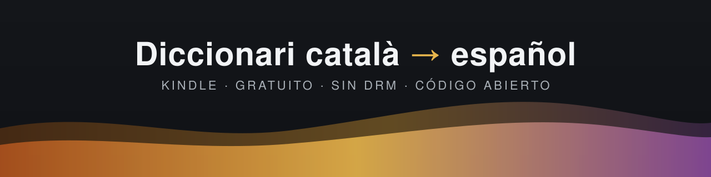
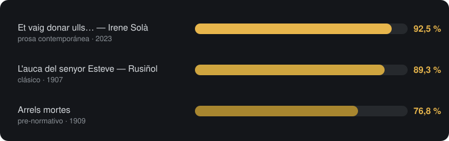

<p align="center">
  
</p>

<p align="center">
  <a href="../../releases/latest"></a>
  &nbsp;
  <a href="LICENSE"></a>
  &nbsp;
  
  &nbsp;
  
</p>

Diccionario bilingüe catalán → español nativo para Amazon Kindle. Más de 54.000 lemas y un millón de formas reconocibles: conjugaciones verbales completas, plurales, femeninos y apóstrofes (`l'amic`, `s'ha`, `d'ull`) resueltos automáticamente hacia su lema. Gratuito, sin DRM y sin registro.

## Descarga e instalación en 4 pasos

1. Descarga el archivo: [catalan-spanish-dictionary-v1.0.0.mobi](../../releases/latest/download/catalan-spanish-dictionary-v1.0.0.mobi) (6,3 MB)
2. Conecta el Kindle al ordenador con el cable USB.
3. Copia el `.mobi` dentro de la carpeta `documents\dictionaries\` del Kindle (si no existe, créala).
4. Expulsa con seguridad y actívalo en el Kindle: *Configuración → Opciones de dispositivo → Idioma y diccionarios → Diccionarios → Catalán*.

Compatible con todos los Kindle (Paperwhite, Oasis, Scribe, Basic…) y con KOReader.

### Comprobación rápida

Abre un libro en catalán, mantén pulsada una palabra:

| Si pulsas... | Verás... |
|---|---|
| `vaig`, `vam`, `anem` | anar (ir) |
| `sóc`, `eren` | ser |
| `tinc`, `tingut` | tenir |
| `parlaven`, `dient` | parlar, dir |
| `l'amic`, `s'ha` | amic, haver |

---

## Qué incluye

- Conjugaciones completas: cualquier forma verbal (`tindria`, `havent`, `parlessin`) salta al infinitivo traducido.
- Plurales y femeninos: `nen → nens/nena`, `casa → cases`.
- Apóstrofes por categoría gramatical: los nombres reciben el artículo (`l'amic`), los verbos todos los clíticos (`s'ha`, `m'anava`).
- Acentos en ambas direcciones: da igual pulsar `bestia` que `bèstia`.
- Contracciones y pronombres débiles: `del`, `pels`, `hi`, `ho`, `en`, `ne`, `cal`.

## Fuentes de datos

El diccionario combina tres proyectos libres; cada uno aporta lo que el otro no tiene:

| Fuente | Aporta | Licencia |
|---|---|---|
| [FreeDict / WikDict](https://freedict.org/) | Base bilingüe ca-es (27.000 lemas) | CC BY-SA 3.0 / GPL |
| [Softcatalà · catalan-dict-tools](https://github.com/Softcatala/catalan-dict-tools) | Morfología catalana (~900.000 formas) | LGPL 2.1 / GPL 2 |
| [Apertium spa-cat](https://github.com/apertium/apertium-spa-cat) | +27.000 pares técnicos y cultos | GPL 2 |

Detalles completos en [NOTICE.md](NOTICE.md).

## Validación

Cobertura medida sobre libros reales, token a token, simulando la búsqueda del Kindle ([metodología](docs/validacion.md)):



Los fallos en clásicos corresponden a ortografía anterior a Fabra (`ab`, `y`, `vehina`); en prosa moderna casi todo lo restante son nombres propios.

## Para desarrolladores

Todo el proceso está automatizado en [`pipeline/build.py`](pipeline/build.py): cruza las fuentes, genera las variantes morfológicas y compila el `.mobi` verificando el formato diccionario (EXTH `REF008000`, ca→es) tras cada build.

```bash
cd pipeline
pip install -r requirements.txt
python build.py                # pipeline completo (~5 min)
python build.py --stage mobi   # solo recompilar
```

Requisitos: Python 3.10+, pyglossary, y el binario [KindleGen v2.9](https://www.amazon.com/gp/feature.html?docId=1000765211) colocado en la ruta indicada al inicio del script (no se redistribuye por su licencia). El método es agnóstico al contenido: sirve para construir diccionarios para otros pares de idiomas combinando un StarDict bilingüe libre + un diccionario morfológico del idioma origen.

## Contribuir

- ¿Una palabra no resuelve? Abre una issue con la palabra y la frase; los huecos reales entran en el suplemento.
- Correcciones de traducciones (provienen de Wiktionary/Apertium) o nuevas fuentes bilingües libres.
- Otros idiomas: si haces fork para otro par, compártelo.

## Licencia

Código y obra resultante bajo [GPL-3.0](LICENSE). Los datos incorporados conservan sus licencias originales ([NOTICE.md](NOTICE.md)). Proyecto independiente, sin afiliación con Amazon.
